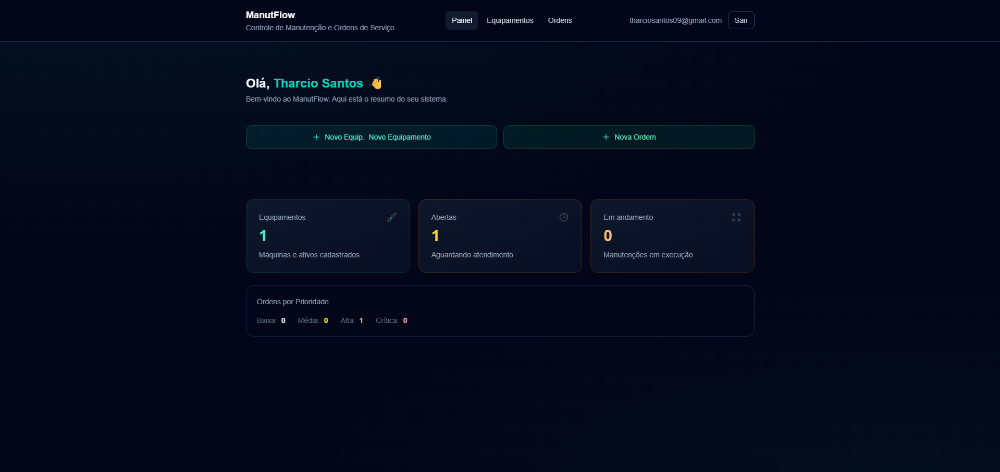
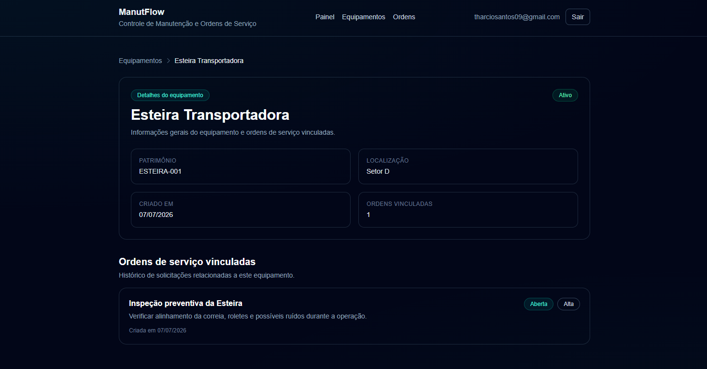
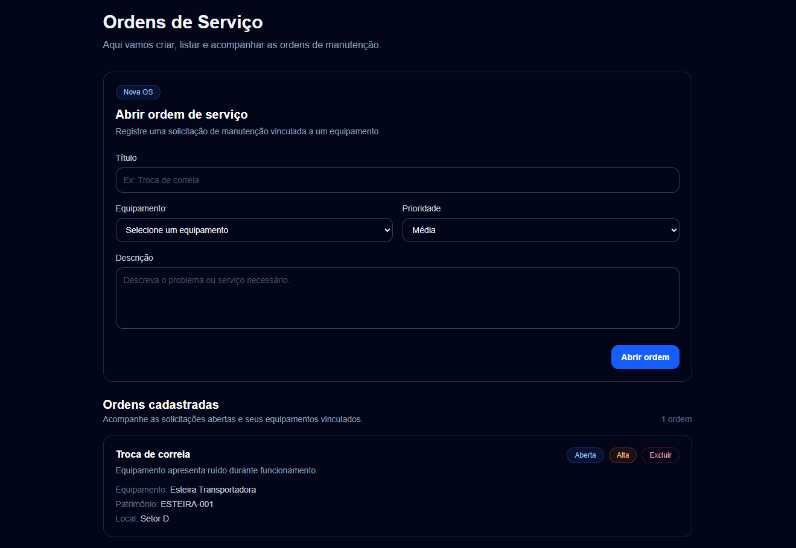
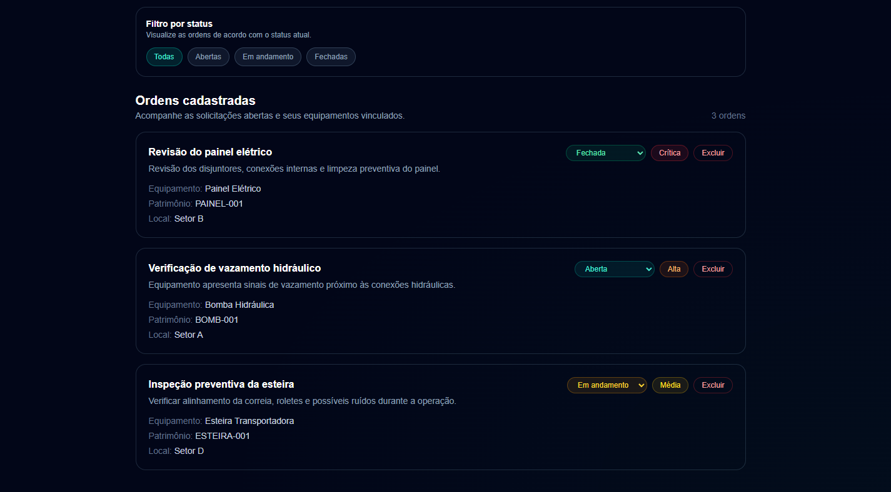
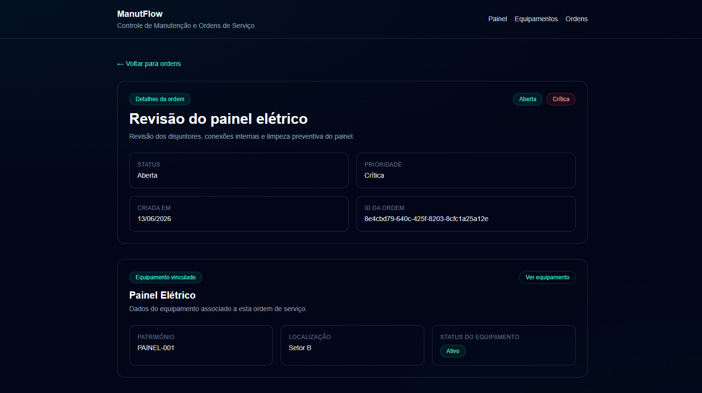
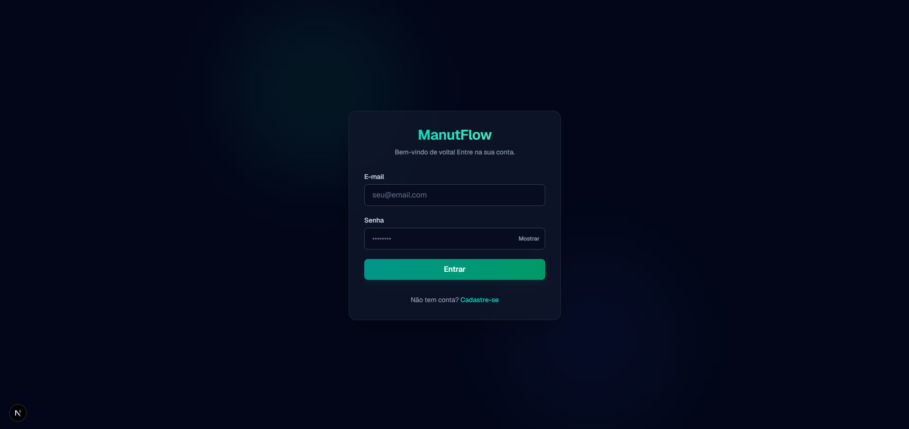
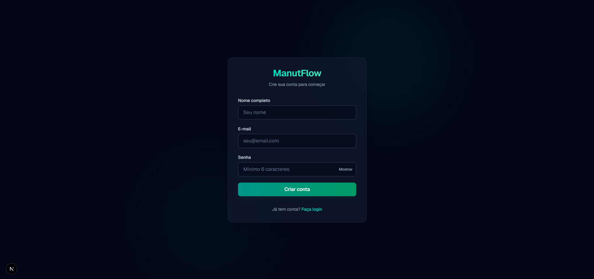

# ManutFlow

Sistema de Controle de Manutenção e Ordens de Serviço desenvolvido como projeto full stack de estudo, com foco em organização de código, banco de dados, regras de negócio e evolução incremental.

O projeto simula um sistema interno usado por empresas para cadastrar equipamentos, abrir ordens de serviço, acompanhar status, definir prioridades e registrar histórico de alterações.

## Preview

### Dashboard

<p align="center">
  
</p>

### Equipamentos

<p align="center">
  
</p>

### Detalhes do equipamento

<p align="center">
  
</p>

### Ordens de Serviço

<p align="center">
  
</p>

<p align="center">
  
</p>

### Detalhes da ordem de serviço

<p align="center">
  
</p>

### Login e Cadastro

<p align="center">
  
</p>

<p align="center">
  
</p>

## Tecnologias

* Next.js
* React
* TypeScript
* Tailwind CSS
* Supabase
* @supabase/ssr
* PostgreSQL
* Git
* GitHub

## Funcionalidades

### Dashboard

* Indicadores reais consumidos do Supabase
* Total de equipamentos cadastrados
* Total de ordens de serviço
* Contagem de ordens por status: abertas, em andamento e fechadas
* Contagem de ordens por prioridade: baixa, média, alta e crítica

### Equipamentos

* Cadastro, listagem e exclusão de equipamentos
* Busca por nome, patrimônio, localização e status
* Filtro por status: ativo, inativo e em manutenção
* Página de detalhes do equipamento
* Exibição das ordens vinculadas ao equipamento
* Bloqueio de exclusão quando existem ordens vinculadas
* Tratamento para código de patrimônio duplicado
* Estados de carregamento, erro e lista vazia

### Ordens de Serviço

* Cadastro de ordens vinculadas a equipamentos
* Listagem com status, prioridade e dados do equipamento relacionado
* Busca por título, descrição, equipamento, patrimônio e local
* Filtro por status: abertas, em andamento e fechadas
* Filtro por prioridade: baixa, média, alta e crítica
* Combinação de busca textual, status e prioridade na listagem
* Alteração de status pela interface
* Exclusão com validação de remoção real na API
* Página de detalhes da ordem
* Exibição do equipamento vinculado
* Histórico de alterações de status

## Arquitetura

O projeto usa uma organização por responsabilidade, separando rotas, componentes, features, tipos e integração com serviços externos.

```text
src/
├── app/
│  ├── api/
│  │  ├── dashboard-summary/
│  │  ├── equipments/
│  │  ├── health/
│  │  └── service-orders/
│  ├── auth/
│  │  └── callback/
│  ├── equipamentos/
│  ├── login/
│  ├── ordens/
│  ├── register/
│  ├── layout.tsx
│  └── page.tsx
├── components/
│  ├── layout/
│  └── ui/
├── features/
│  ├── dashboard/
│  ├── equipments/
│  └── service-orders/
├── lib/
│  └── supabase/
│     ├── client.ts
│     ├── server.ts
│     └── middleware.ts
├── middleware.ts
└── types/
   └── profile.ts
```

## Principais páginas

| Rota                 | Descrição                                                          |
| -------------------- | ------------------------------------------------------------------ |
| `/`                  | Dashboard com indicadores de equipamentos e ordens                 |
| `/equipamentos`      | Cadastro, listagem, busca, filtro e exclusão de equipamentos       |
| `/equipamentos/[id]` | Detalhes do equipamento e ordens vinculadas                        |
| `/ordens`            | Cadastro, listagem, busca, filtro, status e exclusão de ordens     |
| `/ordens/[id]`       | Detalhes da ordem, equipamento vinculado e histórico de alterações |

## Rotas de API

| Método   | Rota                       | Descrição                                                         |
| -------- | -------------------------- | ----------------------------------------------------------------- |
| `GET`    | `/api/health`              | Verifica se a API está respondendo                                |
| `GET`    | `/api/dashboard-summary`   | Retorna indicadores de equipamentos, ordens, status e prioridades |
| `GET`    | `/api/equipments`          | Lista equipamentos                                                |
| `POST`   | `/api/equipments`          | Cadastra equipamento                                              |
| `GET`    | `/api/equipments/[id]`     | Busca detalhes de um equipamento                                  |
| `DELETE` | `/api/equipments/[id]`     | Exclui equipamento com validação de vínculo                       |
| `GET`    | `/api/service-orders`      | Lista ordens de serviço                                           |
| `POST`   | `/api/service-orders`      | Cadastra ordem de serviço                                         |
| `GET`    | `/api/service-orders/[id]` | Busca detalhes da ordem, equipamento e histórico                  |
| `PATCH`  | `/api/service-orders/[id]` | Atualiza status da ordem                                          |
| `DELETE` | `/api/service-orders/[id]` | Exclui ordem com validação de remoção real                        |

## Banco de dados

O banco utiliza PostgreSQL no Supabase.

### `equipments`

Tabela responsável pelos equipamentos cadastrados no sistema.

Campos principais:

* `id`
* `name`
* `patrimony_code`
* `location`
* `status`
* `created_at`
* `updated_at`

Status:

* `active` → Ativo
* `inactive` → Inativo
* `maintenance` → Em manutenção

### `service_orders`

Tabela responsável pelas ordens de serviço.

Campos principais:

* `id`
* `title`
* `description`
* `status`
* `priority`
* `equipment_id`
* `created_at`

Status:

* `open` → Aberta
* `in_progress` → Em andamento
* `closed` → Fechada

Prioridades:

* `low` → Baixa
* `medium` → Média
* `high` → Alta
* `critical` → Crítica

### `service_order_history`

Tabela responsável por registrar alterações de status das ordens.

Campos principais:

* `id`
* `service_order_id`
* `event_type`
* `previous_status`
* `new_status`
* `description`
* `created_at`

### `profiles`

Tabela vinculada ao `auth.users` do Supabase para armazenar dados adicionais do usuário.

Criada automaticamente via trigger quando um novo usuário se cadastra.

Campos principais:

* `id` (vinculado a `auth.users.id`)
* `email`
* `full_name`
* `avatar_url`
* `created_at`
* `updated_at`

Políticas RLS:

* SELECT — usuário só vê seu próprio perfil
* UPDATE — usuário só edita seu próprio perfil
* INSERT — gerenciado pelo trigger automático
* DELETE — não permitido (cascade com auth.users)

## Relacionamentos e regras

Uma ordem de serviço pertence a um equipamento:

```text
equipments.id
     ↓
service_orders.equipment_id
```

Esse relacionamento permite:

* listar ordens com os dados do equipamento vinculado;
* exibir ordens vinculadas na página de detalhes do equipamento;
* exibir o equipamento relacionado na página de detalhes da ordem;
* impedir a exclusão de equipamentos que possuem ordens vinculadas.

A tabela `service_order_history` registra eventos vinculados a uma ordem específica. Atualmente, ela é usada para salvar mudanças de status.

## Validações e regras de negócio

A API valida os dados antes de salvar, atualizar ou excluir registros.

Principais validações implementadas:

* campos obrigatórios no cadastro de equipamentos;
* código de patrimônio único;
* status válido para equipamentos;
* título obrigatório na abertura de ordem;
* prioridade válida;
* status válido ao atualizar uma ordem;
* vínculo obrigatório entre ordem e equipamento;
* bloqueio de exclusão de equipamentos com ordens vinculadas;
* validação de remoção real ao excluir equipamentos e ordens;
* registro de histórico quando o status da ordem é alterado.

## Interface e identidade visual

A interface utiliza tema dark com base em tons de slate e destaques em teal.

A paleta visual separa identidade e semântica:

* `teal` para ações principais, links e elementos de destaque;
* `emerald` para estados positivos, como equipamento ativo;
* `slate` para estados neutros ou encerrados, como ordem fechada;
* `amber` para manutenção ou andamento;
* `yellow`, `orange` e `red` para níveis de prioridade;
* `red` para erros e ações destrutivas.

O objetivo é manter uma aparência consistente, discreta e próxima de um sistema real de uso interno.

## Variáveis de ambiente

As variáveis necessárias estão documentadas no arquivo `.env.example`:

```env
NEXT_PUBLIC_SUPABASE_URL=
NEXT_PUBLIC_SUPABASE_ANON_KEY=
```

Para rodar localmente, copie `.env.example` para `.env.local` e preencha com as credenciais do Supabase.

O arquivo `.env.local` não deve ser enviado para o GitHub.

## Como rodar localmente

Clone o repositório:

```bash
git clone https://github.com/tharciosantos/manutflow.git
```

Entre na pasta:

```bash
cd manutflow
```

Instale as dependências:

```bash
npm install
```

Copie o arquivo de variáveis de ambiente:

```bash
cp .env.example .env.local
```

No Windows PowerShell:

```powershell
Copy-Item .env.example .env.local
```

Rode o servidor:

```bash
npm run dev
```

Acesse:

```text
http://localhost:3000
```

## Próximos passos

* Evoluir o dashboard com métricas por período, equipamentos críticos e ordens em atraso
* Criar middleware de proteção de rotas (redirecionar não autenticados para /login)
* Isolar dados por usuário com coluna `user_id` nas tabelas
* Implementar Row Level Security (RLS) em todas as tabelas
* Adaptar APIs e frontend para filtrar por usuário logado
* Criar testes automatizados
* Adicionar logs básicos
* Fazer deploy em produção

## Aprendizados aplicados

Este projeto reúne práticas importantes de desenvolvimento full stack:

* organização por features;
* rotas dinâmicas no Next.js;
* consumo de API com `fetch`;
* estados de carregamento, erro e lista vazia;
* Server/API Routes com métodos `GET`, `POST`, `PATCH` e `DELETE`;
* integração com Supabase e PostgreSQL;
* modelagem de relacionamentos entre tabelas;
* validação de dados no servidor;
* regras de negócio baseadas em relacionamento;
* histórico de alterações;
* Row Level Security e policies provisórias no Supabase;
* fluxo de branch, commit, Pull Request, merge e limpeza.

> A autenticação foi implementada com Supabase Auth (email/senha), incluindo tabela `profiles` com trigger automático, três clientes Supabase (browser, server, middleware) e páginas de login/cadastro. As próximas etapas incluem middleware de proteção, isolamento de dados por usuário, RLS e adaptação de APIs e frontend.
