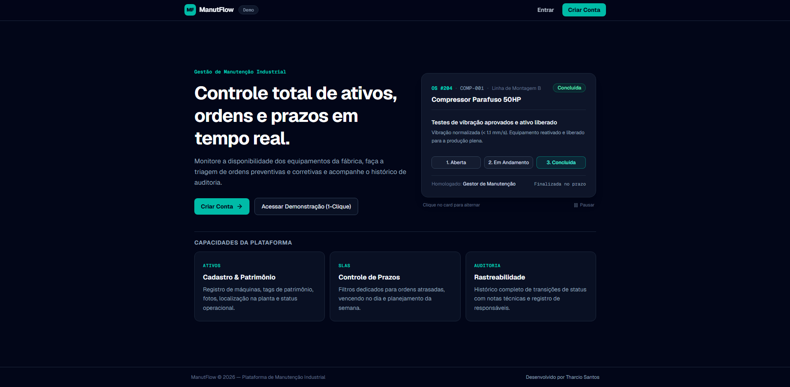
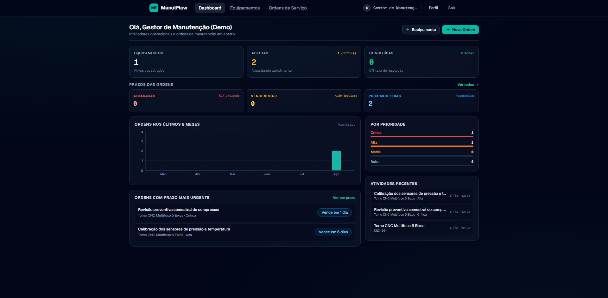
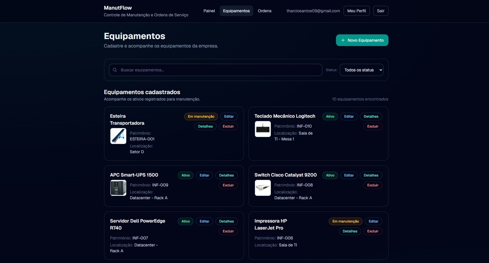
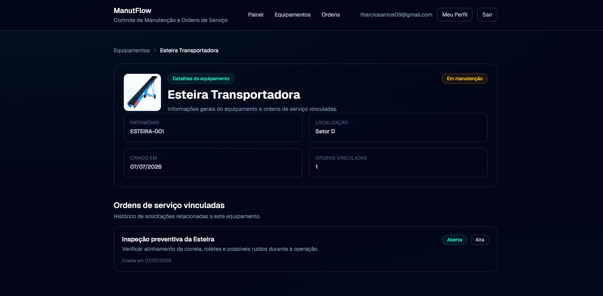
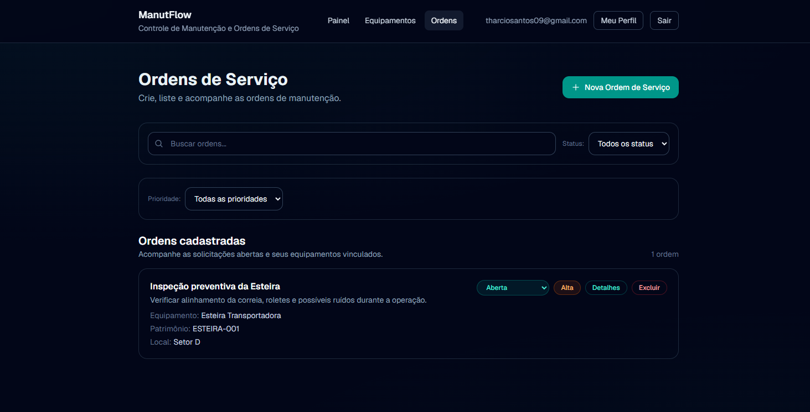
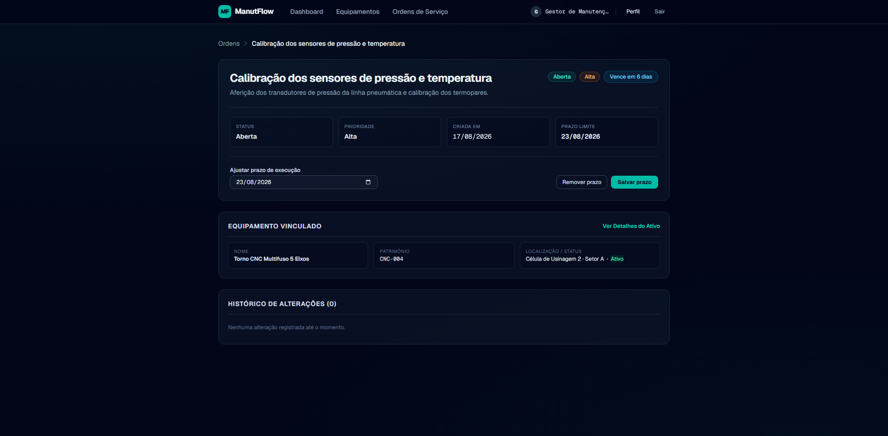
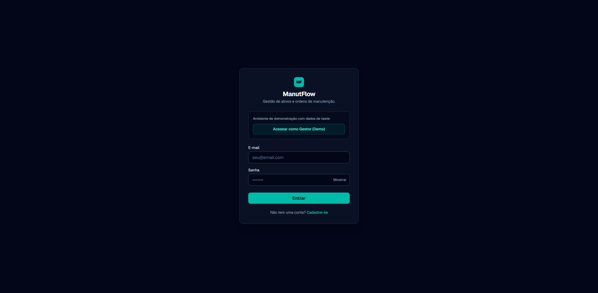
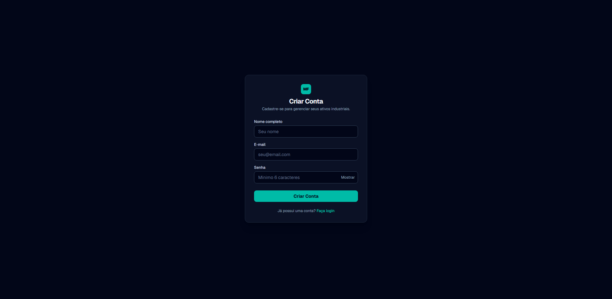

# ManutFlow

Sistema de Gestão de Ativos e Controle de Manutenção Industrial — full stack com Next.js 16, Supabase, TypeScript e Tailwind CSS.

O ManutFlow foi desenvolvido para equipes operacionais e gestores de manutenção que necessitam cadastrar máquinas e equipamentos, rastrear histórico de intervenções e acompanhar ordens de serviço e prazos (SLAs) com precisão técnica, substituindo planilhas manuais e processos descentralizados.

---

## Funcionalidades

### 🌐 Página Inicial & Demonstração Interativa (Pública)
- **Hero Institucional**: Apresentação clara da proposta de valor, acesso rápido ao login e registro.
- **Simulador Interativo de Manutenção (Live Interactive Flow)**: Demonstração em tempo real das 3 etapas de uma ordem de manutenção (*1. Aberta, 2. Em Andamento, 3. Concluída*) com ficha técnica, patrimônio do ativo e auditoria de status sem necessidade de autenticação prévia.
- **Capacidades Operacionais**: Cards técnicos detalhando controle de inventário, conformidade de prazos e rastreabilidade total.
- **Alternância Automática**: Exibição da Landing Page para visitantes e redirecionamento dinâmico para o Dashboard Operacional para usuários autenticados.

### 📊 Dashboard Operacional
- **Indicadores em tempo real**: Total de equipamentos, ordens abertas e concluídas.
- **Controle de Prazos (SLAs)**: Ordens atrasadas, vencendo hoje e nos próximos 7 dias.
- **Atalhos Inteligentes**: Filtros de prazo acionados com 1 clique diretamente dos cards de métricas.
- **Ordens Urgentes**: Destaque para as 5 solicitações com prazo mais crítico.
- **Gráfico Mensal (Recharts)**: Volume de ordens dos últimos 6 meses em gráfico de barras sóbrio e responsivo.
- **Atividades Recentes**: Histórico rápido dos últimos equipamentos cadastrados e ordens abertas.
- **Taxa de Conclusão**: Cálculo percentual automatizado da eficiência operacional.
- **Auto-refresh**: Atualização inteligente de dados ao focar na aba (`visibilitychange`).

### ⚙️ Equipamentos & Ativos
- **CRUD Completo**: Cadastro, edição técnica via modal, listagem e exclusão controlada.
- **Ficha Técnica & Patrimônio**: Identificação unívoca com código mono (`patrimony_code`), localização e criticidade.
- **Upload de Fotos**: Integração com Supabase Storage (JPEG, PNG, WebP até 5MB) com preview e miniaturas.
- **Página de Detalhes**: Visualização do ativo, métricas consolidadas e listagem tabular de ordens vinculadas.
- **Proteção de Integridade**: Bloqueio de exclusão quando o equipamento possui ordens de serviço ativas.
- **Filtros e Paginação**: Busca textual (nome, código, setor), filtro por status operacional e paginação server-side.

### 📋 Ordens de Serviço
- **Abertura & Vinculação**: Criação de ordens associadas a equipamentos com prioridade (`low`, `medium`, `high`, `critical`) e prazo limite.
- **Gestão de Prazos**: Indicadores visuais de SLA (Atrasada, Vence hoje, Próximos 7 dias, Sem prazo) calculados no fuso de Brasília.
- **Alteração Rápida de Status**: Seletor inline com atualização imediata e sincronizada.
- **Histórico & Auditoria**: Rastreabilidade completa de todas as alterações de status e prorrogações de prazo.
- **Página de Detalhes da Ordem**: Layout com dados técnicos do ativo associado, formulário de ajuste de prazo e log cronológico de eventos.

### 👤 Perfil do Usuário
- Gestão de dados pessoais: Nome completo, cargo/função operacional e telefone de contato.
- E-mail e data de cadastro com proteção somente leitura.

### 🛡️ Segurança & Arquitetura
- **Autenticação SSR**: Supabase Auth com gerenciamento de sessão e tokens JWT seguros.
- **Proteção de Rotas**: Controle via `proxy.ts` (Next.js 16) com proteção contra Open Redirect.
- **Row Level Security (RLS)**: Isolamento estrito de dados por `user_id` no banco PostgreSQL.
- **Rate Limiting em Memória**: Proteção contra abusos em mutações e uploads (10–30 req/min).
- **Validação Server-Side**: Sanitização de dados, limites de caracteres e verificação de propriedade de arquivos no Storage.
- **Logging Estruturado**: Logger padronizado em JSON para auditoria técnica.

---

## Preview do Sistema

### 1. Página Inicial & Simulador Interativo (Pública)

<p align="center">
  
</p>

### 2. Dashboard Operacional

<p align="center">
  
</p>

### 3. Equipamentos & Ativos

<p align="center">
  
</p>

### 4. Ficha Técnica do Equipamento

<p align="center">
  
</p>

### 5. Ordens de Serviço

<p align="center">
  
</p>

### 6. Detalhes & Auditoria da Ordem

<p align="center">
  
</p>

### 7. Autenticação (Login & Cadastro)

<p align="center">
  
</p>

<p align="center">
  
</p>

---

## Stack Tecnológica

| Camada | Tecnologia | Finalidade |
|---|---|---|
| **Framework** | Next.js 16 (App Router) | Renderização híbrida SSR/Client, rotas dinâmicas e Server Components |
| **Linguagem** | TypeScript 5 (Strict Mode) | Tipagem estática rigorosa e segurança em tempo de compilação |
| **Estilização** | Tailwind CSS 4 | Design System minimalista, responsividade e utilitários modernos |
| **Banco de Dados** | PostgreSQL (Supabase) | Armazenamento relacional com constraints e índices |
| **Autenticação** | Supabase Auth (SSR) | Sessões seguras com cookies HttpOnly e JWT |
| **Storage** | Supabase Storage | Armazenamento de fotos de equipamentos com controle de permissão |
| **Gráficos** | Recharts | Visualização de séries temporais e volumes mensais |
| **Ícones** | Lucide React | Ícones funcionais e minimalistas |
| **Testes** | Vitest | Testes unitários e de integração (161 testes automatizados) |
| **Qualidade** | ESLint 9 (Flat Config) | Padronização e análise estática de código |

---

## Páginas & Rotas

| Rota | Acesso | Descrição |
|---|---|---|
| `/` | Público / Autenticado | Landing Page institucional com simulador para visitantes; Dashboard operacional para usuários logados |
| `/equipamentos` | Autenticado | Gestão de equipamentos com busca, filtros de status, upload e paginação |
| `/equipamentos/[id]` | Autenticado | Ficha técnica detalhada do ativo com histórico de ordens associadas |
| `/ordens` | Autenticado | Central de ordens de serviço com filtros combinados de SLA, prioridade e status |
| `/ordens/[id]` | Autenticado | Detalhes da ordem, controle de prazos e linha do tempo de auditoria |
| `/perfil` | Autenticado | Gerenciamento de dados cadastrais do operador |
| `/login` | Público | Autenticação com e-mail/senha e botão de acesso rápido Demo (1-Clique) |
| `/register` | Público | Criação de novas contas no sistema |

---

## Rotas de API

| Método | Rota | Descrição |
|---|---|---|
| `GET` | `/api/health` | Verificação de disponibilidade e integridade do serviço |
| `GET` | `/api/dashboard-summary` | Consolidação de totais, prazos, ordens críticas e gráfico |
| `GET` | `/api/equipments` | Listagem paginada de ativos com suporte a filtros e busca |
| `POST` | `/api/equipments` | Cadastro de novo equipamento |
| `GET` | `/api/equipments/[id]` | Consulta de ativo específico e suas ordens de serviço |
| `PATCH` | `/api/equipments/[id]` | Edição parcial de dados do equipamento |
| `DELETE` | `/api/equipments/[id]` | Exclusão de equipamento (com verificação de vínculo) |
| `GET` | `/api/service-orders` | Listagem paginada com ordenação e filtros de status/prazo/prioridade |
| `POST` | `/api/service-orders` | Abertura de nova ordem com especificação opcional de SLA |
| `GET` | `/api/service-orders/[id]` | Consulta da ordem com ativo vinculado e timeline de eventos |
| `PATCH` | `/api/service-orders/[id]` | Atualização de status e/ou prazo com gravação no histórico |
| `DELETE` | `/api/service-orders/[id]` | Exclusão de ordem de serviço |
| `GET` | `/api/profile` | Leitura dos dados do perfil do usuário autenticado |
| `PATCH` | `/api/profile` | Atualização de nome, cargo e telefone |
| `POST` | `/api/upload` | Upload seguro de imagens com validação MIME e rate limit (10/min) |
| `DELETE` | `/api/upload` | Remoção de foto vinculada no bucket de storage |

---

## Estrutura de Pastas

```
manutflow/
├── src/
│   ├── app/
│   │   ├── api/                   # Route Handlers REST
│   │   ├── equipamentos/          # Páginas de listagem e detalhes de ativos
│   │   ├── ordens/                # Páginas de listagem e detalhes de ordens
│   │   ├── perfil/                # Página de perfil do usuário
│   │   ├── login/                 # Página de login com acesso demo
│   │   ├── register/              # Página de registro de usuário
│   │   ├── page.tsx               # Roteamento inteligente: Landing Page ou Dashboard
│   │   ├── layout.tsx             # Layout raiz da aplicação
│   │   └── globals.css            # Diretivas Tailwind CSS
│   ├── components/
│   │   ├── landing/               # LandingHeader, DemoMaintenanceFlow, FeatureCard
│   │   ├── layout/                # AppShell, AppHeader
│   │   └── ui/                    # Modal, StatusCard, Pagination, Breadcrumbs
│   ├── features/
│   │   ├── dashboard/             # Overview, métricas de SLA, gráfico e atividades
│   │   ├── equipments/            # Formulários, listagens, cards e config
│   │   └── service-orders/        # Gestão de ordens, badges de prazo e histórico
│   ├── lib/
│   │   ├── auth.ts                # Obtenção de sessão e autenticação de APIs
│   │   ├── rate-limit.ts          # Rate limiting em memória com expiração
│   │   ├── logger.ts              # Logger estruturado em formato JSON
│   │   └── supabase/              # Clientes Supabase (Browser, Server, Middleware)
│   ├── types/                     # Definições TypeScript (equipment, service-order, profile)
│   └── proxy.ts                   # Middleware Next.js 16 para proteção de sessão SSR
└── public/
    └── previews/                  # Capturas de tela para documentação
```

---

## Demonstração Online

- **Aplicação publicada:** [https://manutflow.vercel.app](https://manutflow.vercel.app)
- **Repositório oficial:** [https://github.com/tharciosantos/manutflow](https://github.com/tharciosantos/manutflow)

### Acesso Rápido Demo (1-Clique)
Na tela de login, clique no botão **"Acessar como Gestor (Demo)"** para entrar com dados pré-configurados (`demo@manutflow.com`) e avaliar o sistema com ativos, ordens e histórico completos em funcionamento.

---

## Como Executar Localmente

### Pré-requisitos
- Node.js 20+
- Conta no Supabase (com projeto configurado)

### Passo a passo

```bash
# 1. Clonar o repositório
git clone https://github.com/tharciosantos/manutflow.git
cd manutflow

# 2. Instalar dependências
npm install

# 3. Configurar variáveis de ambiente
cp .env.example .env.local        # Linux/macOS
Copy-Item .env.example .env.local # PowerShell

# 4. Iniciar servidor de desenvolvimento
npm run dev                       # http://localhost:3000
```

### Variáveis de Ambiente Necessárias (`.env.local`)

```env
NEXT_PUBLIC_SUPABASE_URL=https://seu-projeto.supabase.co
NEXT_PUBLIC_SUPABASE_ANON_KEY=sua-chave-anonima
SUPABASE_SERVICE_ROLE_KEY=sua-service-role-key  # Usado exclusivamente no servidor para upload/storage
```

---

## Testes & Qualidade

```bash
# Executar todos os testes automatizados (Vitest)
npm run test

# Executar testes em modo interativo (Watch)
npm run test:watch

# Checagem estática de tipos
npx tsc --noEmit

# Validação de regras de lint
npm run lint

# Build otimizado para produção
npm run build
```

**Cobertura de Testes**: 169 testes automatizados passando em 17 arquivos de suíte, cobrindo endpoints de API, fluxos de autenticação, cálculos de SLA, rate limiters, storage e componentes de interface.

---

## Fases Implementadas

| # | Fase | Descrição |
|:-:|---|---|
| 0–13 | **Core & Evolução** | CRUD de equipamentos, upload no Storage, filtros combinados, gestão de prazos (SLAs), rate limiting, auditoria e testes automatizados. |
| 14 | **Modernização Visual & Landing Page** | Criação da Landing Page pública com simulador interativo de manutenção, redesign minimalista B2B (estilo Linear/MaintainX), sobriedade visual e eliminação de ruído gráfico. |

