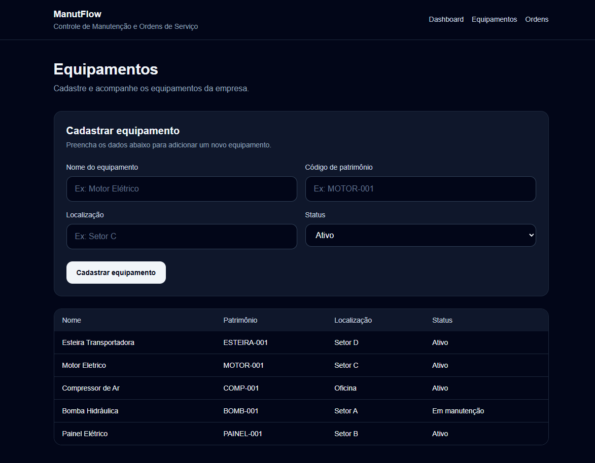

# ManutFlow

Sistema de Controle de Manutenção e Ordens de Serviço desenvolvido como projeto full stack de estudo, com foco em organização de código, banco de dados, boas práticas e deploy.

O projeto está sendo construído do zero como parte de um desafio prático de aprendizado, evoluindo etapa por etapa com foco em entendimento real dos conceitos aplicados.

## Preview

<p align="center">
  
</p>

## Objetivo do projeto

O ManutFlow tem como objetivo simular um sistema usado por empresas para controlar equipamentos, ordens de manutenção, responsáveis, prioridades e histórico de atendimento.

A ideia do projeto é aprender desenvolvimento full stack construindo uma aplicação real, passando por front-end, back-end, banco de dados, autenticação, testes, logs e deploy.

## Tecnologias utilizadas até o momento

* Next.js
* React
* TypeScript
* Tailwind CSS
* Supabase
* PostgreSQL
* Git
* GitHub

## Funcionalidades implementadas

### Estrutura inicial

* Criação do projeto com Next.js, TypeScript e Tailwind CSS
* Configuração inicial da estrutura de pastas
* Criação da página inicial do sistema
* Criação de componentes reutilizáveis
* Criação do cabeçalho da aplicação
* Criação de navegação entre páginas
* Criação das rotas de Dashboard, Equipamentos e Ordens

### API

* Criação da rota `/api/health` para verificar se a API está funcionando
* Criação da rota `/api/equipments`
* Implementação do método `GET` para listar equipamentos
* Implementação do método `POST` para cadastrar equipamentos
* Validação dos dados no servidor antes de salvar no banco
* Tratamento de erro para código de patrimônio duplicado

### Equipamentos

* Criação da tabela `equipments` no Supabase
* Listagem de equipamentos cadastrados no banco de dados
* Cadastro de novos equipamentos pela interface
* Exibição de mensagens de sucesso e erro
* Atualização automática da lista após cadastrar um equipamento
* Tradução dos status técnicos do banco para textos amigáveis na interface

### Segurança e banco de dados

* Configuração do Supabase no projeto
* Uso de PostgreSQL como banco de dados
* Configuração de Row Level Security no Supabase
* Criação de policies para permitir leitura e cadastro de equipamentos durante a fase inicial do projeto

> As permissões atuais são temporárias para desenvolvimento. Futuramente, elas serão ajustadas com autenticação e controle de acesso por usuário.

## Estrutura inicial do projeto

```text
src/
├─ app/
│  ├─ api/
│  │  ├─ equipments/
│  │  └─ health/
│  ├─ equipamentos/
│  ├─ ordens/
│  ├─ layout.tsx
│  └─ page.tsx
├─ components/
│  ├─ layout/
│  └─ ui/
├─ features/
│  ├─ dashboard/
│  ├─ equipments/
│  └─ work-orders/
├─ lib/
└─ types/
```

## Principais páginas

### `/`

Página inicial do sistema, funcionando como dashboard inicial.

### `/equipamentos`

Página responsável por cadastrar e listar os equipamentos da empresa.

### `/ordens`

Página reservada para futuramente criar, listar e acompanhar ordens de serviço.

### `/api/health`

Rota de API criada para verificar se o back-end da aplicação está respondendo corretamente.

### `/api/equipments`

Rota de API responsável por listar e cadastrar equipamentos.

Métodos disponíveis:

```text
GET  /api/equipments
POST /api/equipments
```

## Banco de dados

Até o momento, foi criada a tabela `equipments`.

Campos principais:

* `id`
* `name`
* `patrimony_code`
* `location`
* `status`
* `created_at`
* `updated_at`

Status possíveis no banco:

* `active`
* `inactive`
* `maintenance`

Na interface, esses status são exibidos em português:

* `active` → Ativo
* `inactive` → Inativo
* `maintenance` → Em manutenção

## Fluxo atual de cadastro de equipamento

```text
Usuário preenche o formulário
        ↓
Front-end envia uma requisição POST para /api/equipments
        ↓
API valida os dados recebidos
        ↓
API salva o equipamento no Supabase
        ↓
Banco aplica regras como unique e check
        ↓
API retorna sucesso ou erro
        ↓
Interface exibe a mensagem correta
        ↓
Lista de equipamentos é atualizada automaticamente
```

## Validações atuais

A API valida os seguintes campos antes de cadastrar um equipamento:

* nome do equipamento obrigatório;
* código de patrimônio obrigatório;
* localização obrigatória;
* status válido.

O banco também possui regras importantes:

* `patrimony_code` deve ser único;
* `status` deve aceitar apenas valores permitidos.

## Variáveis de ambiente

O projeto utiliza variáveis de ambiente para conectar com o Supabase.

Exemplo:

```env
NEXT_PUBLIC_SUPABASE_URL=
NEXT_PUBLIC_SUPABASE_PUBLISHABLE_KEY=
```

O arquivo `.env.local` não deve ser enviado para o GitHub.

## Como rodar o projeto localmente

Clone o repositório:

```bash
git clone https://github.com/tharciosantos/manutflow.git
```

Entre na pasta do projeto:

```bash
cd manutflow
```

Instale as dependências:

```bash
npm install
```

Crie o arquivo `.env.local` na raiz do projeto e configure as variáveis do Supabase:

```env
NEXT_PUBLIC_SUPABASE_URL=
NEXT_PUBLIC_SUPABASE_PUBLISHABLE_KEY=
```

Rode o servidor de desenvolvimento:

```bash
npm run dev
```

Acesse no navegador:

```text
http://localhost:3000
```

## Status atual

O projeto está em desenvolvimento.

Atualmente, o sistema já possui:

* base visual criada;
* navegação entre páginas;
* conexão com Supabase;
* API interna para equipamentos;
* listagem de equipamentos;
* cadastro de equipamentos;
* validação no servidor;
* tratamento de erros básicos.

## Próximos passos

* Criar tabela de ordens de serviço
* Relacionar ordens de serviço com equipamentos
* Criar API para listar e cadastrar ordens de serviço
* Criar tela de ordens de serviço
* Implementar alteração de status da ordem
* Criar histórico de alterações
* Implementar autenticação
* Melhorar regras de permissão no Supabase
* Criar testes automatizados
* Adicionar logs básicos
* Fazer deploy em produção

## Aprendizados aplicados

Até o momento, o projeto já passou por conceitos como:

* estrutura de rotas no Next.js;
* componentes reutilizáveis;
* Client Components;
* Server/API Routes;
* consumo de API com `fetch`;
* validação no servidor;
* integração com Supabase;
* uso de variáveis de ambiente;
* Row Level Security;
* tratamento de erro;
* versionamento com Git e GitHub.
